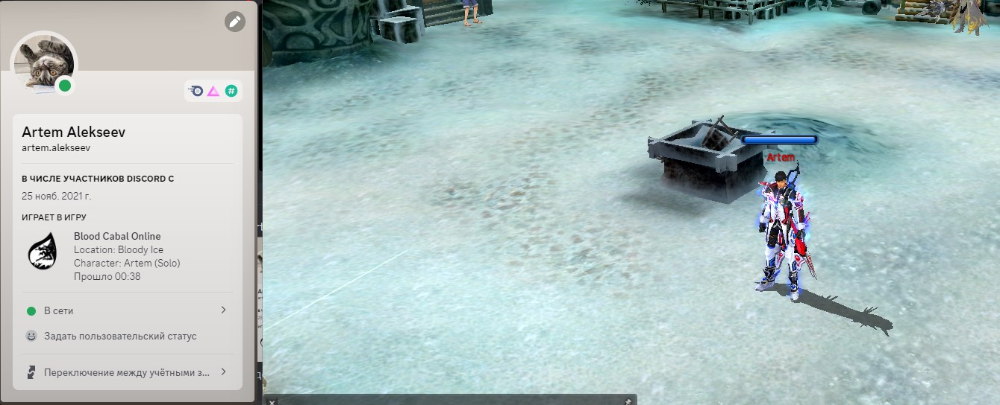
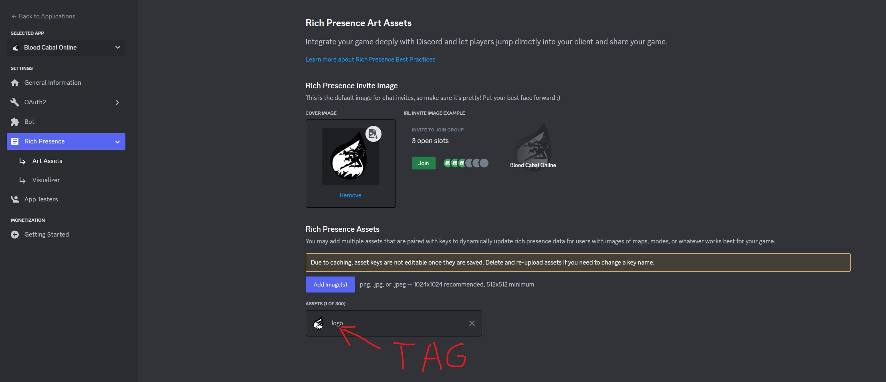

## Settings

### REGISTER

You need register discord application https://discord.com/developers/applications

### APPLICATION ID

Put your application id here
```cpp
Discord_Initialize("YOUR APPLICATION ID", &Handle, 1, NULL);
```

### IMAGE

Put your image tag here!
```cpp
discordPresence.largeImageKey = "IMAGE TAG";
```